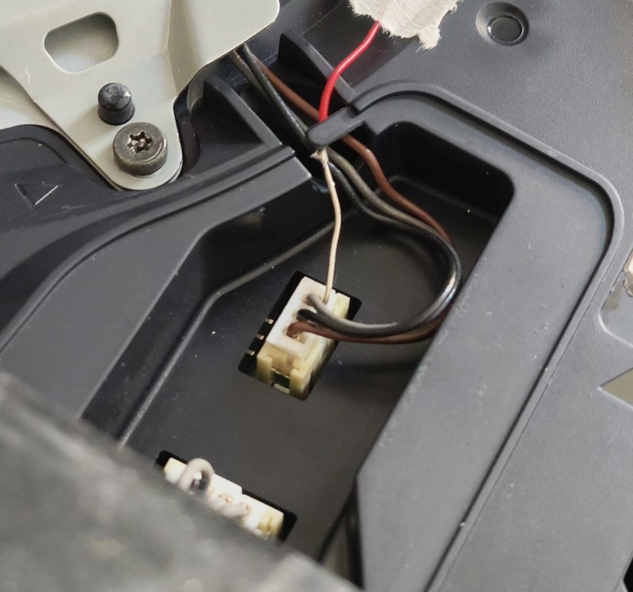

# PS5 Fan PWM Reader - ESP32-C3 OLED

Lecteur PWM pour ventilateur de console SONY PLAYSTATION avec ESP32-C3 + OLED 72x40.

Le firmware mesure le duty-cycle du ventilateur, filtre les valeurs et affiche l'etat en local sur OLED. Il expose aussi une interface Web en mode point d'acces WiFi (AP) pour consulter l'historique, modifier le profil et regler les logs.

<p align="center">
  
</p>

## Etat actuel du projet

- Architecture modulaire C++ sous `src/` (app, network, config, utils).
- Entree principale PlatformIO: `src/main.cpp`.
- Sketch Arduino present: `ps5_fan_pwm_reader.ino` (miroir de l'entree principale).
- Serveur Web embarque avec templates LittleFS (`data/pages`) et fallback HTML/CSS en C++.

## Fonctionnalites

- Mesure PWM par interruption sur GPIO 2.
- Calcul frequence en Hz + filtrage exponentiel.
- Navigation OLED avec bouton (appui court / long).
- 5 pages OLED + ecrans d'erreur (WiFi/PWM absent).
- Historique PWM (72 points en buffer).
- Interface Web locale: login, accueil, historique, profil, console logs.
- Sauvegarde des reglages en NVS (Preferences).

## Cablage par defaut

| Fonction | GPIO |
| --- | --- |
| Entree PWM | GPIO 2 |
| OLED SDA | GPIO 5 |
| OLED SCL | GPIO 6 |
| Bouton navigation | GPIO 9 |
| LED etat thermique | GPIO 8 |

Configuration dans `src/config/pins.h`.

Le bouton est en `INPUT_PULLUP` (`BUTTON_ACTIVE_LOW = true`) : appui = liaison vers GND.

## Configuration logicielle par defaut

- Profil actif par defaut: `PS5_FAT`
- SSID AP: `PlastationFan`
- Mot de passe AP: `Pl@ystati0nf@n`
- URL locale: `http://192.168.4.1`
- Port Web: `80`
- Mot de passe page login: `S0ny`

Ces valeurs sont definies dans `src/config/web_config.h` et `src/config/profiles.h`.

## Affichage OLED

Pages disponibles (`DisplayPage`) :

1. `SimplePwm`: PWM en % (grand affichage)
2. `StatusFace`: etat IDLE / MID / GAME avec mode texte ou smiley
3. `Graph`: historique PWM + max
4. `Details`: PWM courant, max, frequence
5. `Profile`: profil actif (PS3 FAT / PS4 PRO / PS5 FAT)

Navigation bouton :

- Appui court: page suivante
- Appui long (>= 800 ms): retour direct page `SimplePwm`

Cas speciaux :

- Boot screen pendant 5 s (interruption possible au bouton)
- `PWM - KO` si aucun signal detecte depuis 800 ms
- `WIFI - KO` si echec creation AP

## Interface Web

Le firmware cree un point d'acces WiFi local et expose un serveur HTTP.

Routes principales :

- `GET /` : accueil (ou login si non authentifie)
- `GET /login` : page de connexion
- `POST /login` : verification mot de passe + cookie de session
- `GET /history` : page historique
- `GET /api/history` : donnees JSON de l'historique
- `GET /profile` : page profil
- `POST /profile/apply` : sauvegarde profil + reboot
- `POST /profile/reset` : reset config + reboot
- `GET /console` : page logs
- `POST /console/settings` : reglage logs + reboot
- `GET /assets/style.css` : feuille de style

Templates HTML: `data/pages/*.html`.
Style: `data/assets/style.css`.
Si LittleFS est indisponible, fallback HTML/CSS genere en C++.

## Persistance (NVS)

Namespace Preferences: `ps5fan`.

Donnees persistantes principales:

- page OLED active (`page`)
- profil console (`console_profile`)
- seuils par profil (`p5_i_cool`, `p5_i_hot`, `p5_g_cool`, etc.)
- mode icones (`icon_mode`)
- logs Web (`log_level`, `log_refresh`)
- offset seuil global (`threshold_offset`)

## Build et upload (PlatformIO)

Depuis la racine du projet:

```bash
platformio run
platformio run -t buildfs
platformio run -t upload
platformio run -t uploadfs
```

Si `platformio` n'est pas dans le PATH Windows:

```powershell
C:\Users\User\.platformio\penv\Scripts\platformio.exe run
```

## Notes importantes

- Ne jamais injecter un signal 5V directement sur un GPIO ESP32-C3.
- Le filtrage PWM utilise `90% ancienne valeur + 10% nouvelle valeur`.
- Les seuils sont modifiables depuis `/profile`, puis appliques apres redemarrage.
- Si vous modifiez `data/`, upload firmware + filesystem.

## Liens

Boitier 3D : https://makerworld.com/fr/models/2264801-esp32-c3-0-42-oled-case

ESP32 C3 OLED : [Amazon](https://amzn.to/3RfY5Lw) / [AliExpress](https://s.click.aliexpress.com/e/_c4oLGiCb)

Service impression 3D : [JLC3DP](https://jlcpcb.com/fr/?from=CabriDIY_JLCPCB)
